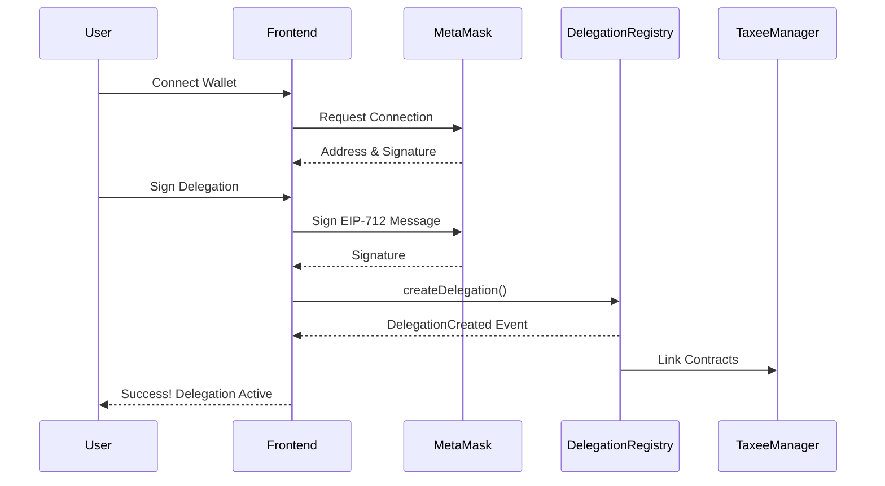
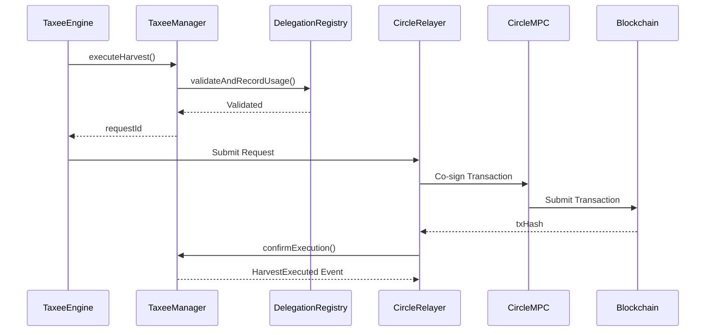

# Contract Interaction Flow

This document shows how the Taxee frontend interacts with the deployed EIP-7702 contracts.

## Contract Addresses (Base Sepolia)

```typescript
const CONTRACTS = {
  baseSepolia: {
    delegationRegistry: '0x403Fe0408976b518b2952BdF590135Ec6ba12ebc',
    taxeeManager: '0xEE8DAE2D3f142052bDb704Ba0D94e04eC1680193',
  }
};
```

## Frontend Integration

### 1. Check if User Has Delegation

```typescript
import { useReadContract } from 'wagmi';

function useDelegationStatus(userAddress: string) {
  const { data } = useReadContract({
    address: CONTRACTS.baseSepolia.delegationRegistry,
    abi: DELEGATION_REGISTRY_ABI,
    functionName: 'hasActiveDelegation',
    args: [userAddress],
  });

  const [hasDelegation, expiration] = data || [false, 0];
  return { hasDelegation, expiration };
}
```

**Contract Call:**
```solidity
function hasActiveDelegation(address user) 
  external 
  view 
  returns (bool hasDelegation, uint256 expiration);
```

**Example Response:**
```json
{
  "hasDelegation": false,
  "expiration": 0
}
```

---

### 2. Create Delegation (Onboarding)

```typescript
import { useSignTypedData, useWriteContract } from 'wagmi';

async function createDelegation() {
  // 1. Sign EIP-712 message
  const signature = await signTypedData({
    domain: {
      name: 'Taxee',
      version: '1',
      chainId: 84532,
      verifyingContract: CONTRACTS.baseSepolia.delegationRegistry,
    },
    types: {
      Delegation: [
        { name: 'delegate', type: 'address' },
        { name: 'policyHash', type: 'bytes32' },
        { name: 'expiration', type: 'uint256' },
        { name: 'maxPerTx', type: 'uint256' },
        { name: 'maxPerMonth', type: 'uint256' },
        { name: 'nonce', type: 'uint256' },
      ],
    },
    primaryType: 'Delegation',
    message: {
      delegate: CONTRACTS.baseSepolia.taxeeManager,
      policyHash: keccak256(policyString),
      expiration: BigInt(Math.floor(Date.now() / 1000) + 90 * 24 * 60 * 60),
      maxPerTx: parseUnits('5000', 18),
      maxPerMonth: parseUnits('20000', 18),
      nonce: BigInt(0),
    },
  });

  // 2. Submit delegation on-chain
  await writeContract({
    address: CONTRACTS.baseSepolia.delegationRegistry,
    abi: DELEGATION_REGISTRY_ABI,
    functionName: 'createDelegation',
    args: [{
      delegate: CONTRACTS.baseSepolia.taxeeManager,
      policyHash: keccak256(policyString),
      expiration: BigInt(Math.floor(Date.now() / 1000) + 90 * 24 * 60 * 60),
      maxPerTx: parseUnits('5000', 18),
      maxPerMonth: parseUnits('20000', 18),
      isActive: true,
      createdAt: 0n,
      signature,
    }],
  });
}
```

**Contract Call:**
```solidity
function createDelegation(Delegation calldata delegation) external;

struct Delegation {
  address delegate;
  bytes32 policyHash;
  uint256 expiration;
  uint256 maxPerTx;
  uint256 maxPerMonth;
  bool isActive;
  uint256 createdAt;
  bytes signature;
}
```

**Event Emitted:**
```solidity
event DelegationCreated(
  address indexed user,
  address indexed delegate,
  bytes32 indexed policyHash,
  uint256 expiration
);
```

---

### 3. Get Monthly Limits

```typescript
function useMonthlyLimits(userAddress: string) {
  const { data } = useReadContract({
    address: CONTRACTS.baseSepolia.delegationRegistry,
    abi: DELEGATION_REGISTRY_ABI,
    functionName: 'getRemainingMonthlyLimit',
    args: [userAddress],
  });

  const [remaining, monthStart] = data || [0n, 0n];
  return {
    remaining: Number(formatUnits(remaining, 18)),
    monthStart: new Date(Number(monthStart) * 1000),
  };
}
```

**Contract Call:**
```solidity
function getRemainingMonthlyLimit(address user) 
  external 
  view 
  returns (uint256 remaining, uint256 monthStart);
```

**Example Response:**
```json
{
  "remaining": "15000000000000000000000", // $15,000 remaining
  "monthStart": "1716500000" // Unix timestamp
}
```

---

### 4. Check if Action Can Execute

```typescript
function useCanExecute(
  userAddress: string,
  action: 'HARVEST' | 'REBUY' | 'YIELD_MOVE',
  asset: string,
  value: string
) {
  const actionType = action === 'HARVEST' ? 0 : action === 'REBUY' ? 1 : 2;
  
  const { data } = useReadContract({
    address: CONTRACTS.baseSepolia.taxeeManager,
    abi: TAXEE_MANAGER_ABI,
    functionName: 'canExecute',
    args: [userAddress, actionType, asset, parseUnits(value, 18)],
  });

  const [canExecute, reason] = data || [false, ''];
  return { canExecute, reason };
}
```

**Contract Call:**
```solidity
function canExecute(
  address user,
  ActionType action,
  address asset,
  uint256 value
) external view returns (bool canExecute, string memory reason);

enum ActionType {
  HARVEST,
  REBUY,
  YIELD_MOVE
}
```

**Example Responses:**
```json
// Success
{
  "canExecute": true,
  "reason": ""
}

// Failure - no delegation
{
  "canExecute": false,
  "reason": "No active delegation"
}

// Failure - limit exceeded
{
  "canExecute": false,
  "reason": "Monthly limit exceeded"
}
```

---

### 5. Execute Harvest (Taxee Backend)

```typescript
// Called by authorized Taxee executor
async function executeHarvest(
  userAddress: string,
  asset: string,
  amount: string,
  estimatedProceeds: string,
  lotId: string
) {
  const tx = await writeContract({
    address: CONTRACTS.baseSepolia.taxeeManager,
    abi: TAXEE_MANAGER_ABI,
    functionName: 'executeHarvest',
    args: [
      userAddress,
      asset,
      parseUnits(amount, 18),
      parseUnits(estimatedProceeds, 18),
      lotId,
    ],
  });

  return tx;
}
```

**Contract Call:**
```solidity
function executeHarvest(
  address user,
  address asset,
  uint256 amount,
  uint256 estimatedProceeds,
  string calldata lotId
) external onlyExecutor returns (bytes32 requestId);
```

**Events Emitted:**
```solidity
event ExecutionRequested(
  address indexed user,
  bytes32 indexed requestId,
  ActionType action,
  uint256 estimatedValue
);

event DelegationUsed(
  address indexed user,
  address indexed delegate,
  uint256 value,
  ActionType action
);
```

---

### 6. Confirm Execution (Circle Relayer)

```typescript
// Called by Circle relayer after MPC signing
async function confirmExecution(
  requestId: string,
  txHash: string,
  actualValue: string,
  success: boolean
) {
  await writeContract({
    address: CONTRACTS.baseSepolia.taxeeManager,
    abi: TAXEE_MANAGER_ABI,
    functionName: 'confirmExecution',
    args: [
      requestId,
      txHash,
      parseUnits(actualValue, 18),
      success,
    ],
  });
}
```

**Contract Call:**
```solidity
function confirmExecution(
  bytes32 requestId,
  bytes32 txHash,
  uint256 actualValue,
  bool success
) external onlyRelayer;
```

**Events Emitted:**
```solidity
event HarvestExecuted(
  address indexed user,
  address indexed asset,
  uint256 amount,
  uint256 proceeds,
  uint256 lossRealized,
  bytes32 txHash
);

event ExecutionConfirmed(
  address indexed user,
  bytes32 indexed requestId,
  bytes32 txHash,
  uint256 actualValue
);
```

---

### 7. Revoke Delegation

```typescript
async function revokeDelegation() {
  await writeContract({
    address: CONTRACTS.baseSepolia.delegationRegistry,
    abi: DELEGATION_REGISTRY_ABI,
    functionName: 'revokeDelegation',
  });
}
```

**Contract Call:**
```solidity
function revokeDelegation() external;
```

**Event Emitted:**
```solidity
event DelegationRevoked(
  address indexed user,
  address indexed delegate,
  uint256 timestamp
);
```

---

## Full User Flow

### Onboarding Flow



### Harvest Execution Flow



## Error Handling

### Common Errors

| Error | Contract | Cause | Solution |
|-------|----------|-------|----------|
| `DelegationNotFound` | DelegationRegistry | User has no active delegation | Create delegation first |
| `DelegationExpired` | DelegationRegistry | Delegation past expiration | Create new delegation |
| `MonthlyLimitExceeded` | DelegationRegistry | Monthly cap reached | Wait for reset or create new delegation |
| `PolicyViolation` | DelegationRegistry | Transaction > per-tx limit | Reduce amount |
| `UnauthorizedCaller` | TaxeeManager | Not authorized executor | Use authorized account |
| `SlippageExceeded` | TaxeeManager | Price moved > 1% | Retry with new price |
| `CooldownActive` | TaxeeManager | < 5 min since harvest | Wait for cooldown |
| `AssetNotAllowed` | TaxeeManager | Asset not in whitelist | Contact Taxee support |

### Frontend Error Handling

```typescript
try {
  await createDelegation(policy, signature);
} catch (error) {
  if (error.message.includes('DelegationExpired')) {
    showError('Your previous delegation expired. Please create a new one.');
  } else if (error.message.includes('PolicyViolation')) {
    showError('Transaction exceeds your policy limits. Adjust settings in dashboard.');
  }
}
```

## Testing

Run the interaction test:

```bash
cd /taxee/contracts
npx hardhat run test-interactions.js --network baseSepolia
```

Expected output:
```
✅ Contract Configuration
✅ Executor Authorization
✅ Circle Relayer
✅ Allowed Assets
✅ Contract Parameters
✅ Delegation Simulation
✅ Execution Validation
```

## Gas Estimates

| Operation | Gas Used |
|-----------|----------|
| Deploy DelegationRegistry | ~2,500,000 |
| Deploy TaxeeManager | ~3,200,000 |
| createDelegation | ~150,000 |
| revokeDelegation | ~45,000 |
| executeHarvest | ~80,000 |
| confirmExecution | ~60,000 |

## Monitoring

Track contract activity:

```bash
# View delegation events
npx hardhat console --network baseSepolia
> const dr = await ethers.getContractAt("DelegationRegistry", "0x403Fe0408976b518b2952BdF590135Ec6ba12ebc");
> await dr.queryFilter("DelegationCreated");
```

---

## Integration Checklist

- [ ] Frontend connected to Base Sepolia
- [ ] Contract addresses configured in wagmi.ts
- [ ] User can connect MetaMask wallet
- [ ] User can sign EIP-712 delegation
- [ ] Delegation created successfully on-chain
- [ ] Dashboard shows delegation status
- [ ] Monthly limits display correctly
- [ ] Harvest opportunity can be validated
- [ ] Taxee backend can execute transactions
- [ ] Circle relayer confirms executions
